# Design Document: Code Component Refactor

## نظرة عامة (Overview)

إعادة هيكلة كود موقع DOMAINPUT من بنية monolithic (خصوصاً `Index.tsx` بـ 1400+ سطر) إلى بنية component-based منظمة تطابق التصميم في `design/new.pen`. العملية هي pure refactoring — لا تغيير في الشكل أو الوظائف أو الأنماط.

### المبدأ الأساسي

- **Extract, Don't Rewrite**: نقل الكود كما هو إلى ملفات جديدة مع تعديل الـ imports فقط
- **Props Down, Events Up**: الـ state يبقى في أعلى مستوى ممكن ويُمرر كـ props
- **Shared Layout Components**: NavBar و Footer مشتركين بين كل الصفحات

## البنية المعمارية (Architecture)

### هيكل المجلدات المستهدف

```
src/
├── components/
│   ├── layout/           # Components مشتركة بين الصفحات
│   │   ├── NavBar.tsx
│   │   └── Footer.tsx
│   ├── sections/         # أقسام الصفحات
│   │   ├── HeroSection.tsx
│   │   ├── StatsSection.tsx
│   │   ├── FeaturesSection.tsx
│   │   ├── ExtensionsSection.tsx
│   │   ├── DomainsForSaleSection.tsx
│   │   ├── TestimonialsSection.tsx
│   │   ├── CTASection.tsx
│   │   ├── CartSidebar.tsx
│   │   ├── PortfolioHeader.tsx
│   │   ├── FilterBar.tsx
│   │   ├── PortfolioGrid.tsx
│   │   └── ContactFormSection.tsx
│   ├── effects/          # تأثيرات الخلفية والأنيميشن
│   │   ├── BackgroundEffects.tsx
│   │   └── SvgBackgrounds.tsx
│   ├── ui/               # بطاقات ومكونات UI قابلة لإعادة الاستخدام
│   │   ├── StatCard.tsx
│   │   ├── FeatureCard.tsx
│   │   ├── TestimonialCard.tsx
│   │   ├── ExtensionCard.tsx
│   │   ├── AnimatedCounter.tsx
│   │   ├── TypingEffect.tsx
│   │   └── ... (shadcn existing)
│   ├── DomainCard.tsx        # موجود - لا يتغير
│   ├── LanguageSwitcher.tsx  # موجود - لا يتغير
│   ├── MarketplaceLogo.tsx   # موجود - لا يتغير
│   ├── MobileMenu.tsx        # موجود - لا يتغير
│   └── NavLink.tsx           # موجود - لا يتغير
├── pages/
│   ├── Index.tsx         # يصبح composition فقط (~50-80 سطر)
│   ├── Portfolio.tsx     # يستخدم NavBar/Footer المشتركين
│   ├── Contact.tsx       # يستخدم NavBar/Footer المشتركين
│   └── NotFound.tsx      # لا يتغير
├── layouts/
│   └── UserLayout.tsx    # Layout مشترك يلف كل الصفحات (NavBar + children + Footer)
├── data/
│   └── domains.ts        # لا يتغير
└── ...
```

### Shared Layout Pattern

بدلاً من أن كل صفحة تستورد NavBar و Footer بشكل منفصل، سنستخدم `UserLayout` في `src/layouts/UserLayout.tsx` يلف جميع الصفحات في `App.tsx`. هذا يضمن أن NavBar و Footer يظهران مرة واحدة فقط في الكود ويُعرضان تلقائياً لكل صفحة.

#### UserLayout (`src/layouts/UserLayout.tsx`)

```typescript
interface UserLayoutProps {
  children: React.ReactNode;
  cart?: string[];
}
```

- يحتوي على NavBar في الأعلى و Footer في الأسفل
- يعرض `children` (محتوى الصفحة) بينهما
- يُستخدم في App.tsx كـ wrapper لجميع الـ Routes

#### التكامل مع App.tsx

```tsx
// App.tsx
<UserLayout cart={cart}>
  <Routes>
    <Route
      path="/"
      element={<Index />}
    />
    <Route
      path="/portfolio"
      element={<Portfolio />}
    />
    <Route
      path="/contact"
      element={<Contact />}
    />
  </Routes>
</UserLayout>
```

### مخطط التبعيات (Dependency Diagram)

```mermaid
graph TD
    subgraph App
        AppTsx[App.tsx]
        UserLayoutComp[UserLayout.tsx]
    end

    subgraph Pages
        Index[Index.tsx]
        Portfolio[Portfolio.tsx]
        Contact[Contact.tsx]
    end

    subgraph Layout
        NavBar[NavBar.tsx]
        Footer[Footer.tsx]
    end

    subgraph Sections
        Hero[HeroSection.tsx]
        Stats[StatsSection.tsx]
        Features[FeaturesSection.tsx]
        Extensions[ExtensionsSection.tsx]
        Domains[DomainsForSaleSection.tsx]
        Testimonials[TestimonialsSection.tsx]
        CTA[CTASection.tsx]
        CartSB[CartSidebar.tsx]
        PH[PortfolioHeader.tsx]
        FB[FilterBar.tsx]
        PG[PortfolioGrid.tsx]
        CFS[ContactFormSection.tsx]
    end

    subgraph UI Cards
        SC[StatCard.tsx]
        FC[FeatureCard.tsx]
        TC[TestimonialCard.tsx]
        EC[ExtensionCard.tsx]
        AC[AnimatedCounter.tsx]
        TE[TypingEffect.tsx]
    end

    subgraph Effects
        BG[BackgroundEffects.tsx]
        SVG[SvgBackgrounds.tsx]
    end

    subgraph Existing
        DC[DomainCard.tsx]
        LS[LanguageSwitcher.tsx]
        MM[MobileMenu.tsx]
    end

    AppTsx --> UserLayoutComp
    UserLayoutComp --> NavBar
    UserLayoutComp --> Footer

    Index --> Hero
    Index --> Stats
    Index --> Features
    Index --> Extensions
    Index --> Domains
    Index --> Testimonials
    Index --> CTA
    Index --> CartSB
    Index --> BG

    Portfolio --> PH
    Portfolio --> FB
    Portfolio --> PG

    Contact --> CFS

    Hero --> TE
    Hero --> SVG
    Stats --> SC
    SC --> AC
    Features --> FC
    Features --> SVG
    Extensions --> EC
    Domains --> DC
    Testimonials --> TC
    CTA --> SVG

    NavBar --> LS
    NavBar --> MM
    PG --> DC
```



## المكونات والواجهات (Components and Interfaces)

### 1. Layout Components

#### Layout (`src/layouts/UserLayout.tsx`)

```typescript
interface UserLayoutProps {
  children: React.ReactNode;
  cart?: string[];
}
```

- يلف جميع الصفحات بـ NavBar في الأعلى و Footer في الأسفل
- يُستخدم في App.tsx كـ wrapper حول Routes
- يمرر `cart` prop إلى NavBar

#### NavBar (`src/components/layout/NavBar.tsx`)

```typescript
interface NavBarProps {
  cart?: string[];
  onCartClick?: () => void;
}
```

- يُستخرج من Index.tsx (سطور 480-570 تقريباً)
- يحتوي على: Logo، Nav Links، LanguageSwitcher، Cart button، CTA button، Mobile menu toggle
- يستخدم `useTranslation()` داخلياً للنصوص
- يستخدم `MobileMenu` component الموجود
- يقبل `cart` prop لعرض عدد العناصر في السلة

#### Footer (`src/components/layout/Footer.tsx`)

```typescript
// لا يحتاج props — يستخدم i18n داخلياً
```

- يُستخرج من Index.tsx (سطور 1250-1370 تقريباً)
- يحتوي على: 4 أعمدة (brand, products, company, support) + bottom bar
- يستخدم `useTranslation()` داخلياً

### 2. Section Components

#### HeroSection (`src/components/sections/HeroSection.tsx`)

```typescript
interface HeroSectionProps {
  cart: string[];
  onAddToCart: (domain: string) => void;
}
```

- يُستخرج من Index.tsx (سطور 575-870 تقريباً)
- يحتوي على: AI badge, headline, TypingEffect, tab switcher, search bar, extension pills, search results, scroll indicator
- يدير state داخلي: `searchQuery`, `activeTab`, `showResults`, `isSearching`
- يستخدم `HexGrid` من effects
- يستخدم `TypingEffect` من ui

#### StatsSection (`src/components/sections/StatsSection.tsx`)

```typescript
// لا يحتاج props — البيانات والترجمات داخلية
```

- يُستخرج من Index.tsx (سطور 875-935 تقريباً)
- يحتوي على: grid من 4 `StatCard` components
- يعرّف مصفوفة `stats` داخلياً مع i18n

#### FeaturesSection (`src/components/sections/FeaturesSection.tsx`)

```typescript
// لا يحتاج props
```

- يُستخرج من Index.tsx (سطور 940-1020 تقريباً)
- يحتوي على: section header + grid من 4 `FeatureCard` components
- يستخدم `HexGrid` كخلفية

#### ExtensionsSection (`src/components/sections/ExtensionsSection.tsx`)

```typescript
// لا يحتاج props
```

- يُستخرج من Index.tsx (سطور 1025-1080 تقريباً)
- يحتوي على: section header + grid من 8 `ExtensionCard` components

#### DomainsForSaleSection (`src/components/sections/DomainsForSaleSection.tsx`)

```typescript
// لا يحتاج props
```

- يُستخرج من Index.tsx (سطور 1085-1140 تقريباً)
- يحتوي على: section header + grid من DomainCards (featured فقط) + زر "View Portfolio"
- يستخدم `HexGrid` كخلفية
- يستخدم `DomainCard` الموجود

#### TestimonialsSection (`src/components/sections/TestimonialsSection.tsx`)

```typescript
// لا يحتاج props
```

- يُستخرج من Index.tsx (سطور 1145-1200 تقريباً)
- يحتوي على: section header + grid من 3 `TestimonialCard` components

#### CTASection (`src/components/sections/CTASection.tsx`)

```typescript
// لا يحتاج props
```

- يُستخرج من Index.tsx (سطور 1200-1250 تقريباً)
- يحتوي على: NeuralNetwork background + icon + headline + description + 2 buttons

#### CartSidebar (`src/components/sections/CartSidebar.tsx`)

```typescript
interface CartSidebarProps {
  cart: string[];
  onRemoveFromCart: (domain: string) => void;
}
```

- يُستخرج من Index.tsx (سطور 1375-1430 تقريباً)
- يعرض قائمة الدومينات في السلة مع زر حذف وزر checkout

#### PortfolioHeader (`src/components/sections/PortfolioHeader.tsx`)

```typescript
// لا يحتاج props
```

- يُستخرج من Portfolio.tsx — القسم العلوي (tag + title + description)

#### FilterBar (`src/components/sections/FilterBar.tsx`)

```typescript
interface FilterBarProps {
  searchQuery: string;
  onSearchChange: (query: string) => void;
  categories: string[];
  selectedCategory: string;
  onCategoryChange: (category: string) => void;
}
```

- يُستخرج من Portfolio.tsx — شريط البحث والفلترة

#### PortfolioGrid (`src/components/sections/PortfolioGrid.tsx`)

```typescript
interface PortfolioGridProps {
  domains: Domain[];
}
```

- يُستخرج من Portfolio.tsx — grid عرض الدومينات مع حالة "no results"

#### ContactFormSection (`src/components/sections/ContactFormSection.tsx`)

```typescript
// لا يحتاج props — يستخدم useSearchParams داخلياً
```

- يُستخرج من Contact.tsx — النموذج بالكامل مع back button و form header

### 3. UI Card Components

#### StatCard (`src/components/ui/StatCard.tsx`)

```typescript
interface StatCardProps {
  value: number;
  suffix: string;
  label: string;
  icon: LucideIcon;
  index: number;
}
```

- بطاقة إحصائية واحدة مع AnimatedCounter

#### FeatureCard (`src/components/ui/FeatureCard.tsx`)

```typescript
interface FeatureCardProps {
  icon: LucideIcon;
  title: string;
  description: string;
  stats: string;
  color: string;
  index: number;
}
```

- بطاقة ميزة واحدة مع أيقونة وإحصائية

#### TestimonialCard (`src/components/ui/TestimonialCard.tsx`)

```typescript
interface TestimonialCardProps {
  name: string;
  role: string;
  quote: string;
  avatar: string;
  index: number;
}
```

- بطاقة شهادة مع نجوم واقتباس ومعلومات المؤلف

#### ExtensionCard (`src/components/ui/ExtensionCard.tsx`)

```typescript
interface ExtensionCardProps {
  ext: string;
  price: number;
  discount: string | null;
  index: number;
}
```

- بطاقة امتداد مع اسم وسعر وtag خصم اختياري

### 4. Effect Components

#### BackgroundEffects (`src/components/effects/BackgroundEffects.tsx`)

```typescript
// DataStreams و FloatingParticles — لا يحتاجان props
export const DataStreams: React.FC;
export const FloatingParticles: React.FC;
```

#### SvgBackgrounds (`src/components/effects/SvgBackgrounds.tsx`)

```typescript
// HexGrid و NeuralNetwork — لا يحتاجان props
export const HexGrid: React.FC;
export const NeuralNetwork: React.FC;
```

### 5. Utility UI Components

#### AnimatedCounter (`src/components/ui/AnimatedCounter.tsx`)

```typescript
interface AnimatedCounterProps {
  value: number;
  suffix?: string;
}
```

#### TypingEffect (`src/components/ui/TypingEffect.tsx`)

```typescript
interface TypingEffectProps {
  texts: string[];
}
```

## نماذج البيانات (Data Models)

لا توجد نماذج بيانات جديدة. جميع الأنواع الموجودة تبقى كما هي:

```typescript
// من src/data/domains.ts — لا يتغير
interface Domain {
  name: string;
  description?: string;
  image?: string;
  category?: string;
  highlight?: boolean;
  listings: {
    platform: string;
    price: number;
    url: string;
  }[];
}
```

الـ interfaces الجديدة هي فقط Props interfaces للـ components المستخرجة (موضحة أعلاه) وهي ليست data models بل عقود واجهات.

## خصائص الصحة (Correctness Properties)

_خاصية الصحة هي سلوك أو خاصية يجب أن تكون صحيحة عبر جميع التنفيذات الصالحة للنظام — بمعنى آخر، مواصفة رسمية لما يجب أن يفعله النظام. الخصائص تربط بين المواصفات المقروءة للبشر وضمانات الصحة القابلة للتحقق آلياً._

بما أن هذا المشروع هو refactoring بحت (نقل كود موجود بدون تغيير وظيفي)، معظم معايير القبول تتعلق بتنظيم الملفات (غير قابلة للاختبار كخصائص) أو بالتطابق البصري (اختبارات snapshot). الخصائص القابلة للاختبار كـ properties محدودة لكنها مهمة:

**Property 1: Cart state round-trip through props** _For any_ domain string added to the cart via HeroSection's `onAddToCart` callback, the CartSidebar component should display that domain in its list, and removing it via `onRemoveFromCart` should remove it from the list. **Validates: Requirements 6.2**

**Property 2: i18n translations work correctly in all extracted components** _For any_ extracted component that uses `useTranslation()` and _for any_ supported locale, rendering the component with that locale should produce text content that matches the corresponding translation keys from the locale file (not raw translation keys). **Validates: Requirements 2.4, 9.2**

**Property 3: FilterBar search filtering is consistent** _For any_ list of domains and _for any_ search query string, the PortfolioGrid should display only domains whose names contain the search query (case-insensitive), and selecting a category filter should further restrict results to that category only. **Validates: Requirements 7.6**

## معالجة الأخطاء (Error Handling)

بما أن هذا refactoring بحت، لا توجد حالات خطأ جديدة. جميع حالات الخطأ الموجودة تبقى كما هي:

1. **Import Resolution Errors**: إذا تم نقل ملف ولم يتم تحديث الـ import، سيفشل TypeScript compilation. الحل: تحديث جميع الـ imports بعد كل عملية نقل.
2. **Missing Props**: إذا لم يتم تمرير prop مطلوب لـ component مستخرج، سيظهر TypeScript error. الحل: تعريف interfaces واضحة لكل component.
3. **i18n Key Mismatches**: إذا تم نقل `useTranslation()` call بشكل خاطئ. الحل: التأكد من أن كل component يستدعي `useTranslation()` بشكل مستقل.

## استراتيجية الاختبار (Testing Strategy)

### النهج المزدوج

#### 1. اختبارات الوحدة (Unit Tests)

- **Snapshot Tests**: لكل component مستخرج، إنشاء snapshot test يتحقق من أن الـ rendered output مطابق
- **Render Tests**: التأكد من أن كل صفحة (Index, Portfolio, Contact) تعرض جميع الـ sections المتوقعة
- **Props Tests**: التأكد من أن الـ components تقبل وتستخدم الـ props بشكل صحيح

#### 2. اختبارات الخصائص (Property-Based Tests)

- مكتبة الاختبار: **fast-check** مع **vitest** (موجود في المشروع)
- الحد الأدنى: 100 تكرار لكل اختبار خاصية
- كل اختبار يُعلّم بتعليق يشير إلى الخاصية في التصميم

**تنسيق التعليقات:**

```typescript
// Feature: code-component-refactor, Property 1: Cart state round-trip through props
// Feature: code-component-refactor, Property 2: i18n translations work correctly
// Feature: code-component-refactor, Property 3: FilterBar search filtering is consistent
```

#### 3. التحقق من البناء (Build Verification)

- أهم اختبار: `tsc --noEmit` — إذا نجح TypeScript compilation بدون أخطاء، فإن جميع الـ imports صحيحة وجميع الـ props types متوافقة
- `vite build` — التأكد من أن البناء ينجح بدون أخطاء

### أولوية الاختبارات

1. TypeScript compilation (يكشف أخطاء الـ imports والـ types)
2. Snapshot tests (يكشف تغييرات بصرية غير مقصودة)
3. Property tests (يتحقق من السلوك الوظيفي)
4. Render tests (يتحقق من تكامل الـ components)
