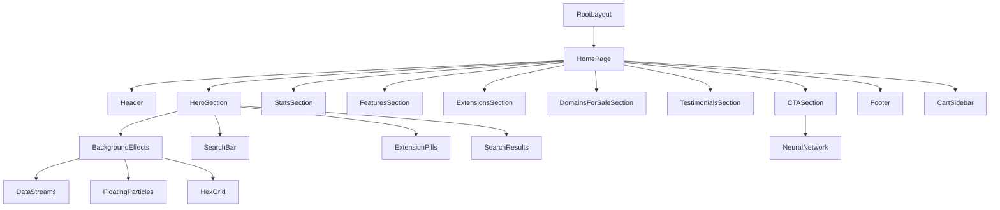

# Design Document: Next.js Migration

## Overview

This document describes the technical design for migrating the Domainput landing page from Vite/React to Next.js 15 with App Router. The design focuses on creating a clean, maintainable architecture that preserves the existing visual design while leveraging Next.js features for better performance and developer experience.

## Architecture

### High-Level Architecture

```
nextjs-app2/
├── app/                          # Next.js App Router
│   ├── layout.tsx               # Root layout with providers
│   ├── page.tsx                 # Home page (Server Component)
│   ├── globals.css              # Global styles
│   └── [locale]/                # i18n routing (optional)
├── components/
│   ├── ui/                      # Reusable UI primitives
│   ├── layout/                  # Layout components
│   ├── sections/                # Page sections
│   └── effects/                 # Animation effects
├── data/                        # Static data
├── hooks/                       # Custom React hooks
├── lib/                         # Utilities and configs
├── types/                       # TypeScript types
├── messages/                    # i18n translation files
└── public/                      # Static assets
```

### Component Architecture



### Server vs Client Components Strategy

**Principle: Keep Client Components as small as possible. Only wrap the interactive parts, not entire sections.**

#### Granular Client Component Approach

```
Section (Server) → Contains static markup
  └── InteractiveWrapper (Client) → Only the interactive part
```

| Component                       | Rendering | Reason                        |
| ------------------------------- | --------- | ----------------------------- |
| **Layout Components**           |           |                               |
| RootLayout                      | Server    | Static structure              |
| Header (wrapper)                | Server    | Static nav structure          |
| └── HeaderClient                | Client    | Cart icon, mobile menu state  |
| └── LanguageSwitcher            | Client    | Language selection state      |
| Footer                          | Server    | Fully static                  |
| **Section Components**          |           |                               |
| HeroSection (wrapper)           | Server    | Static headings, structure    |
| └── SearchBar                   | Client    | Input state, search logic     |
| └── SearchResults               | Client    | Results display, cart actions |
| └── ExtensionPills              | Client    | Hover animations only         |
| StatsSection (wrapper)          | Server    | Static grid structure         |
| └── StatCard                    | Client    | AnimatedCounter only          |
| FeaturesSection (wrapper)       | Server    | Static grid, headings         |
| └── FeatureCard                 | Client    | Hover animations only         |
| ExtensionsSection (wrapper)     | Server    | Static grid, headings         |
| └── ExtensionCard               | Client    | Hover animations only         |
| DomainsForSaleSection (wrapper) | Server    | Static headings               |
| └── DomainsGrid                 | Client    | Pagination state              |
| TestimonialsSection (wrapper)   | Server    | Static headings               |
| └── TestimonialCard             | Client    | Star animations only          |
| CTASection (wrapper)            | Server    | Static headings, buttons      |
| └── CTAAnimations               | Client    | Rocket animation              |
| **Effect Components**           |           |                               |
| BackgroundEffects               | Client    | All animations                |
| DataStreams                     | Client    | framer-motion                 |
| FloatingParticles               | Client    | framer-motion                 |
| HexGrid                         | Server    | Static SVG                    |
| NeuralNetwork                   | Client    | framer-motion                 |
| **Shared Components**           |           |                               |
| CartSidebar                     | Client    | Cart state, animations        |
| AnimatedCounter                 | Client    | Number animation              |
| TypingEffect                    | Client    | Text animation                |

#### Benefits of This Approach

1. **Smaller JavaScript bundles** - Less code sent to client
2. **Faster initial page load** - More content rendered on server
3. **Better SEO** - Static content is crawlable
4. **Easier testing** - Server components are simpler to test
5. **Future-proof** - Easy to convert more to server when possible

## Components and Interfaces

### UI Primitives (`components/ui/`)

```typescript
// components/ui/button.tsx
interface ButtonProps {
  variant?: "primary" | "secondary" | "ghost";
  size?: "sm" | "md" | "lg";
  children: React.ReactNode;
  onClick?: () => void;
  disabled?: boolean;
  className?: string;
}

// components/ui/input.tsx
interface InputProps {
  placeholder?: string;
  value: string;
  onChange: (value: string) => void;
  onKeyDown?: (e: React.KeyboardEvent) => void;
  className?: string;
}

// components/ui/badge.tsx
interface BadgeProps {
  variant?: "default" | "cyber";
  children: React.ReactNode;
  className?: string;
}

// components/ui/card.tsx
interface CardProps {
  variant?: "default" | "holo" | "glass";
  children: React.ReactNode;
  className?: string;
}
```

### Layout Components (`components/layout/`)

```typescript
// components/layout/header.tsx
interface HeaderProps {
  cart: string[];
  onCartClick?: () => void;
}

// components/layout/footer.tsx
// No props - uses translations internally

// components/layout/container.tsx
interface ContainerProps {
  children: React.ReactNode;
  className?: string;
}
```

### Section Components (`components/sections/`)

```typescript
// components/sections/hero-section.tsx
interface HeroSectionProps {
  onAddToCart: (domain: string) => void;
  cart: string[];
}

// components/sections/stats-section.tsx
// No props - uses static data

// components/sections/features-section.tsx
// No props - uses static data

// components/sections/extensions-section.tsx
// No props - uses static data

// components/sections/domains-for-sale-section.tsx
// No props - uses static data with internal pagination

// components/sections/testimonials-section.tsx
// No props - uses static data

// components/sections/cta-section.tsx
// No props - static content with animations

// components/sections/cart-sidebar.tsx
interface CartSidebarProps {
  cart: string[];
  onRemove: (domain: string) => void;
  onCheckout: () => void;
}
```

### Effect Components (`components/effects/`)

```typescript
// components/effects/data-streams.tsx
// No props - self-contained animation

// components/effects/floating-particles.tsx
// No props - self-contained animation

// components/effects/hex-grid.tsx
// No props - SVG pattern

// components/effects/neural-network.tsx
// No props - SVG animation

// components/effects/animated-counter.tsx
interface AnimatedCounterProps {
  value: number;
  suffix?: string;
}

// components/effects/typing-effect.tsx
interface TypingEffectProps {
  texts: string[];
}
```

## Data Models

### Domain Types (`types/domain.ts`)

```typescript
export interface DomainResult {
  domain: string;
  available: boolean;
  price: number;
  popular: boolean;
}

export interface DomainExtension {
  ext: string;
  price: number;
  discount: string | null;
  hot: boolean;
}
```

### Feature Types (`types/feature.ts`)

```typescript
import { LucideIcon } from "lucide-react";

export interface Feature {
  icon: LucideIcon;
  title: string;
  description: string;
  stats: string;
  color: string;
}
```

### Stat Types (`types/stat.ts`)

```typescript
import { LucideIcon } from "lucide-react";

export interface Stat {
  value: number;
  label: string;
  suffix: string;
  icon: LucideIcon;
}
```

### Testimonial Types (`types/testimonial.ts`)

```typescript
export interface Testimonial {
  name: string;
  role: string;
  quote: string;
  avatar: string;
}
```

### Static Data Files (`data/`)

```typescript
// data/extensions.ts
export const extensions: DomainExtension[] = [
  { ext: ".com", price: 9.99, discount: "POPULAR", hot: true },
  { ext: ".io", price: 34.99, discount: null, hot: true },
  // ...
];

// data/features.ts
export const getFeatures = (t: (key: string) => string): Feature[] => [
  {
    icon: Brain,
    title: t("features.neuralDNS.title"),
    description: t("features.neuralDNS.description"),
    stats: "0.001ms",
    color: "from-blue-500 to-blue-600",
  },
  // ...
];

// data/stats.ts
export const getStats = (t: (key: string) => string): Stat[] => [
  {
    value: 2500000,
    label: t("stats.domainsIndexed"),
    suffix: "+",
    icon: Globe,
  },
  // ...
];

// data/testimonials.ts
export const getTestimonials = (t: (key: string) => string): Testimonial[] => [
  // ...
];

// data/domains-for-sale.ts
export const generateDomainsForSale = (): string[] => {
  // Domain generation logic
};

// data/nav-items.ts
export const getNavItems = (t: (key: string) => string): string[] => [
  t("nav.domains"),
  t("nav.hosting"),
  // ...
];
```

### Custom Hooks (`hooks/`)

```typescript
// hooks/use-cart.ts
export function useCart() {
  const [cart, setCart] = useState<string[]>([]);

  const addToCart = (domain: string) => {
    if (!cart.includes(domain)) {
      setCart([...cart, domain]);
    }
  };

  const removeFromCart = (domain: string) => {
    setCart(cart.filter((d) => d !== domain));
  };

  return { cart, addToCart, removeFromCart };
}

// hooks/use-domain-search.ts
export function useDomainSearch() {
  const [searchQuery, setSearchQuery] = useState("");
  const [isSearching, setIsSearching] = useState(false);
  const [showResults, setShowResults] = useState(false);

  const handleSearch = () => {
    if (searchQuery.trim()) {
      setIsSearching(true);
      setTimeout(() => {
        setIsSearching(false);
        setShowResults(true);
      }, 2000);
    }
  };

  return {
    searchQuery,
    setSearchQuery,
    isSearching,
    showResults,
    setShowResults,
    handleSearch,
  };
}

// hooks/use-pagination.ts
export function usePagination<T>(items: T[], itemsPerPage: number) {
  const [currentPage, setCurrentPage] = useState(1);

  const totalPages = Math.ceil(items.length / itemsPerPage);
  const startIndex = (currentPage - 1) * itemsPerPage;
  const endIndex = startIndex + itemsPerPage;
  const currentItems = items.slice(startIndex, endIndex);

  return {
    currentPage,
    setCurrentPage,
    totalPages,
    currentItems,
    startIndex,
    endIndex,
  };
}
```

## Internationalization (i18n)

### Setup with next-intl

```typescript
// i18n/config.ts
export const locales = ['en', 'ar', 'es', 'fr', 'de', 'zh', 'ja', 'ko', 'pt', 'ru'];
export const defaultLocale = 'en';

// messages/en.json
{
  "nav": {
    "domains": "Domains",
    "hosting": "Hosting",
    // ...
  },
  "hero": {
    "aiStatus": "AI ENGINE ONLINE",
    // ...
  }
}
```

### Usage in Components

```typescript
// In Client Components
'use client';
import { useTranslations } from 'next-intl';

export function HeroSection() {
  const t = useTranslations();
  return <h1>{t('hero.claim')}</h1>;
}
```

## Error Handling

### Search Error States

```typescript
interface SearchState {
  status: "idle" | "loading" | "success" | "error";
  error?: string;
  results?: DomainResult[];
}
```

### Error Boundary

```typescript
// components/error-boundary.tsx
'use client';

export function ErrorBoundary({ children }: { children: React.ReactNode }) {
  return (
    <ErrorBoundaryPrimitive fallback={<ErrorFallback />}>
      {children}
    </ErrorBoundaryPrimitive>
  );
}
```

## Testing Strategy

### Unit Tests

- Test utility functions in `lib/`
- Test custom hooks with React Testing Library
- Test data transformation functions

### Property-Based Tests

- Test domain generation produces valid domains
- Test pagination logic with various input sizes

### Integration Tests

- Test search flow from input to results display
- Test cart add/remove functionality
- Test language switching

## Correctness Properties

_A property is a characteristic or behavior that should hold true across all valid executions of a system—essentially, a formal statement about what the system should do. Properties serve as the bridge between human-readable specifications and machine-verifiable correctness guarantees._

### Property 1: Search Results Contain Valid Domain Data

_For any_ search query string, when search results are generated, each result should contain a valid domain name (query + extension), a boolean availability status, a numeric price greater than 0, and available domains should be actionable (have acquire capability).

**Validates: Requirements 5.2, 5.3**

### Property 2: Cart Addition Preserves Domain

_For any_ domain string added to the cart, the cart array should contain that exact domain string, and the cart length should increase by 1 (if domain was not already in cart).

**Validates: Requirements 5.4**

### Property 3: Cart Removal Removes Only Target Domain

_For any_ cart state and any domain to remove, after removal the cart should not contain the removed domain, and all other domains should remain unchanged.

**Validates: Requirements 5.4**

### Property 4: Translation Keys Resolve to Non-Empty Strings

_For any_ supported locale and any translation key used in the application, the resolved translation should be a non-empty string.

**Validates: Requirements 6.3**

### Property 5: Pagination Produces Correct Slices

_For any_ array of items and any valid page number, the pagination hook should return a slice of items where:

- The slice length is at most itemsPerPage
- The slice contains the correct items for that page
- startIndex and endIndex are correctly calculated

**Validates: Requirements 3.6 (Domains for Sale pagination)**

### Property 6: Domain Generation Produces Valid Domains

_For any_ call to generateDomainsForSale, all generated domains should:

- Be non-empty strings
- Contain exactly one dot
- Have a valid TLD extension

**Validates: Requirements 3.6**
